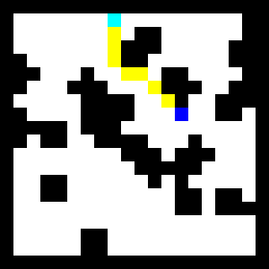

# vin-keras

This is an implimentation of [VIN(Value Iteration Networks)](https://arxiv.org/abs/1602.02867) in keras.

* 16x16 Grid world datasets from [vin(chainer) repository](https://github.com/peisuke/vin)

First, train and save VIN model.

    $ python train.py

Next, predict path on the test data.

    $ python predict.py

An example of the results are shown below.

## Reference
* [VIN(original)](https://github.com/avivt/VIN)
* [tensorflow-value-iteration-networks](https://github.com/TheAbhiKumar/tensorflow-value-iteration-networks)
* [vin(chainer)](https://github.com/peisuke/vin)

## Requirements
* Keras
* python-opencv
* numpy
* joblib